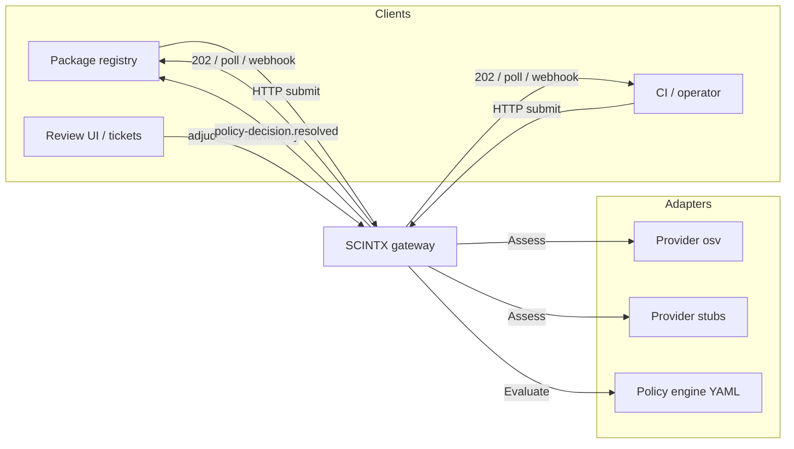
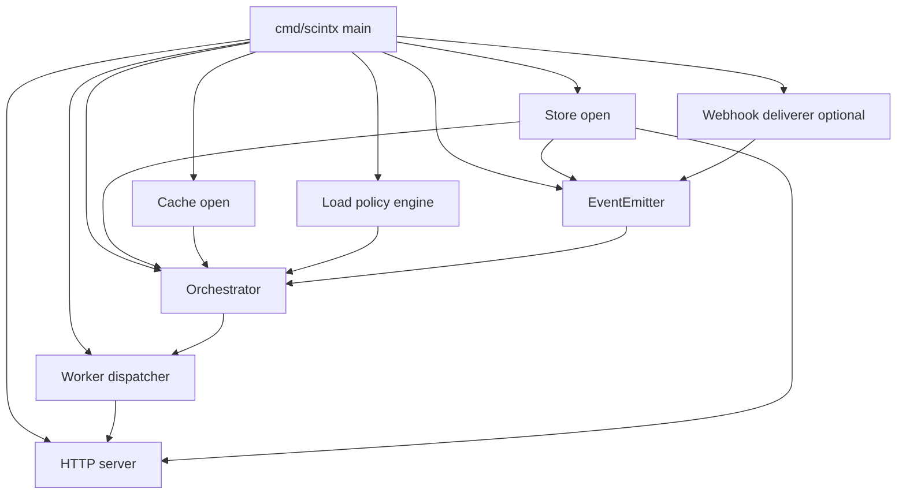
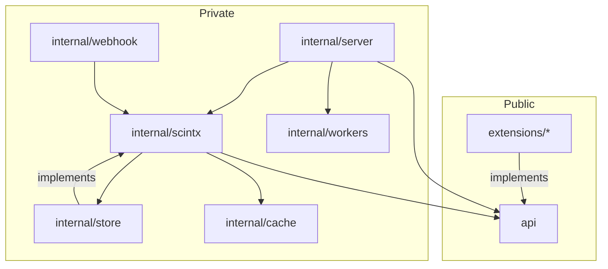
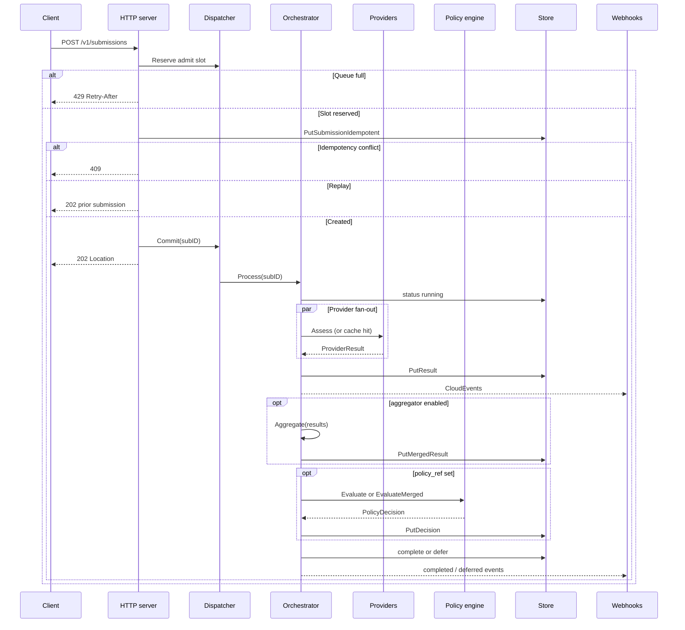
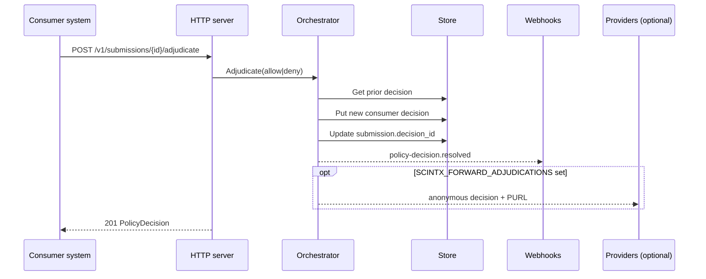
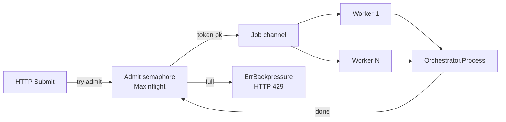
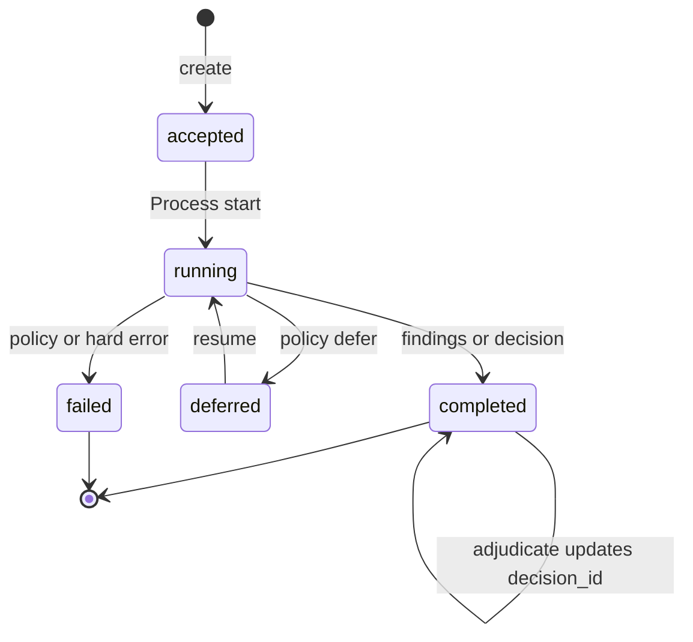
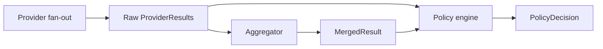
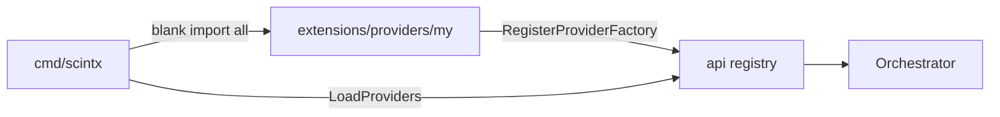
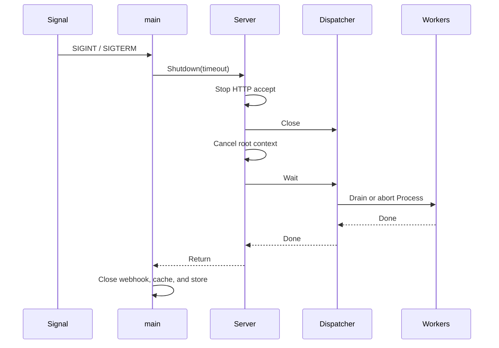

# SCINTX Architecture

## 1. Purpose

This document describes the reference gateway architecture.

SCINTX is a supply-chain security interchange layer.

The gateway accepts package submissions.

The gateway calls security providers.

The gateway applies policy.

The gateway returns decisions and findings.

Consumers may resolve `review` decisions outside the gateway and share the final outcome back.

---

## 2. Technical nouns

Use these terms with one meaning only.

| Term | Meaning |
| --- | --- |
| **Gateway** | The SCINTX HTTP process (`cmd/scintx`). |
| **Submission** | One assessment request for one artifact. |
| **Artifact** | The package identity (PURL, digests, content). |
| **Provider** | A scanner adapter that assesses an artifact. |
| **Policy engine** | A component that maps results to a decision. |
| **Orchestrator** | The component that runs providers and policy. |
| **Store** | State for submissions, results, decisions, events. Default `memory` is ephemeral (forwarder). `sqlite` / `postgres` are durable. |
| **Cache** | Optional store of successful provider results. |
| **Dispatcher** | The worker pool that runs `Process` jobs. |
| **EventEmitter** | Component that appends CloudEvents and optionally delivers webhooks. |
| **Webhook deliverer** | Outbound signed CloudEvent POST client. |
| **Adjudication** | Consumer-shared final `allow` / `deny` for a completed submission. |
| **Aggregator** | An optional component that correlates and deduplicates findings across providers after fan-out, before policy evaluation. |
| **MergedResult** | A deduplicated, cross-provider finding view with full source attribution. |
| **Extension** | A provider or policy plugin package. |

---

## 3. System context

The gateway sits between clients and providers.



**Facts**

- Clients send submissions on HTTP.
- Clients poll submission state or receive signed webhooks.
- The gateway does not replace scanners.
- Providers implement `api.Provider`.
- Policy engines implement `api.PolicyEngine`.
- Human or org resolution happens in the consumer system.
- The consumer shares the final gate with `POST .../adjudicate`.

---

## 4. Process layout

One binary starts all core parts.



**Startup sequence**

1. Open the store.
2. Build the event emitter.
3. Open the webhook deliverer when `SCINTX_WEBHOOK_URL` is set.
4. Load the policy engine.
5. Open the cache.
6. Build the orchestrator.
7. Load providers from the registry (`SCINTX_PROVIDERS` may filter).
8. Build the HTTP server.
9. Open the dispatcher with the server root context.
10. Attach the dispatcher to the server.
11. Listen for HTTP.

---

## 5. Package map

```text
scintx/
├── api/                 Public types and plugin interfaces
├── cmd/scintx/          Process entry
├── cmd/gen-extensions/  Extension import generator
├── extensions/
│   ├── providers/       osv, stub-osv, stub-secrets, …
│   └── policies/        yaml, example, …
├── internal/
│   ├── server/          HTTP adapter
│   ├── scintx/          Orchestrator, memory store, events, job queue
│   ├── store/           SQLite and Postgres store + SQL job queue
│   ├── cache/           none, ristretto, redis
│   ├── workers/         Local and queue dispatchers
│   └── webhook/         Signed CloudEvent delivery
├── policies/            YAML policy documents
├── schema/              JSON Schema Draft 2020-12
├── openapi/             HTTP contract
├── scripts/             build, check, stress, …
└── test/e2e/            End-to-end tests
```



**Import rule**

- Extension packages must import `api` only.
- Extension packages must not import `internal/`.

---

## 6. Request flow

### 6.1 Create submission



**Rules**

- The dispatcher reserves capacity first.
- The server writes the submission next.
- A full pool does not create a submission.
- A reused Idempotency-Key with a different body returns 409.
- The client polls `GET /v1/submissions/{id}` or receives webhooks.
- Clients read findings with `GET /v1/submissions/{id}/results` or `GET /v1/results/{id}`.
- Clients read the aggregated view with `GET /v1/submissions/{id}/merged` (404 when aggregation is disabled).
- Clients read decisions with `GET /v1/decisions/{id}`.

### 6.2 Resume deferred submission

1. The client calls `POST /v1/submissions/{id}/resume`.
2. The store claims the submission (deferred → running) with a compare-and-set.
3. The dispatcher admits the job.
4. If admit fails, the store releases the claim (running → deferred).

Use resume only for `defer` (wait for more evidence). Do not use resume for human review.

### 6.3 Consumer adjudication

Machine policy may return `review` (or another terminal decision).

Resolution happens in the consumer system that plugs into SCINTX results.



**Rules**

- Submission must be `completed` and must already have a policy decision.
- Shared decision must be `allow` or `deny`.
- Prior machine decision stays immutable.
- New decision sets `extensions.origin=consumer` and `prior_decision_id`.
- `submission.decision_id` points at the new decision.
- Event `org.eclipse.scintx.policy-decision.resolved.v1` is emitted (and webhooks).
- Anonymous provider forwarding is **off by default**. Enable with `SCINTX_FORWARD_ADJUDICATIONS=osv,ossindex` (allowlist). Only providers that set `accepts_adjudications` and implement `AdjudicationReceiver` are called. Payload is `decision` + `purl` only. Failures are logged and never fail the HTTP response.

---

## 7. Worker pool and backpressure

The dispatcher limits concurrent work.



**Modes**

| Mode | Env | Behavior |
| --- | --- | --- |
| `local` | `SCINTX_WORKER_MODE=local` | In-process pool (default). |
| `queue` | `SCINTX_WORKER_MODE=queue` | Shared `jobs` table + lease claims. |

**Controls**

| Variable | Effect |
| --- | --- |
| `SCINTX_WORKERS` | Concurrent `Process` slots (local) or claim workers (queue). |
| `SCINTX_MAX_INFLIGHT` | Max jobs admitted (running + queued) in local mode. |
| `SCINTX_JOB_QUEUE_SIZE` | Optional. Sets max = workers + queue (local). |
| `SCINTX_WORKER_MODE` | `local` or `queue`. |

**Facts**

- `MaxInflight = 0` disables the local admit limit.
- Close and Submit share one lock.
- Panic in `Process` does not leak admit slots (local) and leaves leases reclaimable (queue).
- Horizontal scale uses more gateway processes, a shared store, and queue mode.

---

## 8. Orchestrator

The orchestrator runs one submission to an end state.



**Steps in Process**

1. Load the submission.
2. Set status to running.
3. Select providers that match the artifact and requested capabilities.
4. Call Assess for each selected provider in parallel.
5. Use the cache for successful completed results when enabled.
6. Store each result and emit provider events.
7. If an aggregator is configured, run it and store the `MergedResult` (non-fatal on error).
8. If `policy_ref` is empty, complete with findings only.
9. If policy is set, call `EvaluateMerged` when the engine supports it and a `MergedResult` exists; otherwise call `Evaluate`.
10. Store the decision.
11. Complete, defer, or fail.

**Decision values**

| Value | Meaning |
| --- | --- |
| `allow` | Machine policy accepts. |
| `deny` | Machine policy blocks. |
| `review` | Needs consumer resolution; submission completes. |
| `defer` | Wait and resume later. |

---

## 9. Result aggregation

The aggregator is an optional pipeline stage that runs after provider fan-out and before policy evaluation.

It is activated by passing `WithResultAggregator` to the orchestrator.

Raw `ProviderResult` objects are never modified. The `MergedResult` is a derived, additive view.

### 9.1 Pipeline position



### 9.2 Correlation key

Each `Finding` receives a stable hash key used to group observations across providers.

| Finding type | Key material | Scheme |
| --- | --- | --- |
| Vulnerability with CVE identifiers | `"sca/v1"` + subject PURL + sorted CVE IDs only | `sca/v1` |
| Vulnerability without CVE (GHSA, OSV, etc.) | `"sca/v1"` + subject PURL + sorted all IDs | `sca/v1` |
| Secret finding | `"secret/v1"` + finding type + subject PURL | `secret/v1` |
| No identifiers, no subject | provider ID + finding ID | fallback (no cross-provider merge) |

CVE IDs are the authoritative anchor.
Two findings from different providers that both cite `CVE-2024-1234` share a key even if they carry different ecosystem IDs (GHSA, OSV, etc.).

### 9.3 Assessment reconciliation (VEX lattice)

| Sources agree | Reconciled status | Conflicts |
| --- | --- | --- |
| All `not_affected` | `not_affected` | none |
| Any `affected` | `affected` | result_ids of sources that said `not_affected` |
| Any `under_investigation`, none `affected` | `under_investigation` | none |
| `affected` vs `not_affected` from different providers | `under_investigation` | result_ids of disagreeing sources |

Conflicts are listed in `MergedFinding.Consensus.Conflicts`.

The YAML policy escalates on conflicts via `spec.merge_conflicts` (default: `review`).

### 9.4 Severity consensus

| Strategy | Behaviour |
| --- | --- |
| `max` (default) | Highest score per scheme wins. |
| `mean` | Average score per scheme across sources. |
| `trust_weighted` | Weighted average using `spec.provider_priority` weights. |

### 9.5 MergedFinding structure

```
MergedFinding
  CorrelationKey  — stable hash (the grouping key)
  Type            — finding type (e.g. "vulnerability")
  Title           — most descriptive title across sources
  Identifiers     — union of all source identifiers, CVEs first
  Sources         — [{ProviderID, ResultID, FindingID}] for each observation
  Severity        — consensus severity observations
  Assessment      — reconciled VEX assessment
  Consensus       — {Strategy, SourceCount, Conflicts}
```

### 9.6 Merge-aware policy

A policy engine implements `api.MergeAwarePolicyEngine` to opt in.

The YAML engine does this automatically.

`EvaluateMerged` handles two phases:

1. **Execution phase** — walks raw `ProviderResult`s for errors, timeouts, and missing verdicts (same as `Evaluate`).
2. **Finding phase** — walks `MergedFinding`s instead of raw findings so each CVE is counted once.

Decision reasons still carry `result_id` and `finding_id` for full attribution.

---

## 10. Persistence and cache

### 10.1 Store

| Driver | Env | Use |
| --- | --- | --- |
| `memory` (default) | unset or `SCINTX_STORE=memory` | **Forwarder mode**: in-process ephemeral state. Submissions are processed and returned; nothing survives restart. |
| `sqlite` | `SCINTX_STORE=sqlite` | Single-node durable state. |
| `postgres` | `SCINTX_STORE=postgres` | Shared durable state. |

When storage is not defined, the gateway still runs. It uses the memory store as a forwarder: accept → providers → policy → respond (poll/webhooks work until the process exits).

The store holds submissions, results, merged results, decisions, events, artifacts, provider capability snapshots, and (in queue mode) jobs.

One `MergedResult` is stored per submission. It is replaced on resume.

Getters return copies. Callers do not share mutable maps with workers.

### 10.2 Cache

| Backend | Env | Scope |
| --- | --- | --- |
| `none` | `SCINTX_CACHE=none` | No cache. |
| `ristretto` | `SCINTX_CACHE=ristretto` | In-process. |
| `redis` | `SCINTX_CACHE=redis` | Shared across processes. |

The cache stores successful provider assessments only. It does not cache `MergedResult`.

---

## 11. Extensions

Extensions register factories in `init()`.

`go generate` builds `extensions/*/all` import lists.



**Interfaces**

- `Provider` — assess an artifact.
- `PolicyEngine` — evaluate results.
- `ResultAggregator` — correlate and deduplicate findings across providers (optional, wired via `WithResultAggregator`).
- `MergeAwarePolicyEngine` — extends `PolicyEngine` with `EvaluateMerged`; the YAML engine implements this automatically.

Submission sources (CI, package registries, feed bridges such as
[ossf/package-feeds](https://github.com/ossf/package-feeds)) call
`POST /v1/submissions` over HTTP. They are not in-process extensions.

**Reference providers**

| ID | Role |
| --- | --- |
| `osv` | Live OSV.dev HTTP API (`SCINTX_OSV_BASE_URL`). |
| `ossindex` | Live Sonatype OSS Index HTTP API. Auth via `scintx auth ossindex` or `SCINTX_OSSINDEX_*`. |
| `stub-osv` | Offline vulnerability stub for demos and e2e. |
| `stub-secrets` | Offline secrets stub. |

**Provider filter**

Set `SCINTX_PROVIDERS` to a comma-separated allowlist (example: `osv,stub-secrets`).

Empty means load every registered factory.

See [EXTENSIONS.md](EXTENSIONS.md) for add procedures.

---

## 12. HTTP surface

Primary routes:

| Method | Path | Action |
| --- | --- | --- |
| `POST` | `/v1/submissions` | Create submission. |
| `GET` | `/v1/submissions/{id}` | Read submission. |
| `GET` | `/v1/submissions/{id}/results` | List provider results. |
| `GET` | `/v1/submissions/{id}/merged` | Read cross-provider aggregated findings. 404 when aggregation is not enabled. |
| `POST` | `/v1/submissions/{id}/resume` | Resume deferred work. |
| `POST` | `/v1/submissions/{id}/adjudicate` | Share consumer allow/deny resolution. |
| `GET` | `/v1/results/{id}` | Read one provider result. |
| `GET` | `/v1/decisions/{id}` | Read one policy decision. |
| `GET` | `/v1/providers` | List providers. |
| `GET` | `/v1/providers/{id}/capabilities` | Read capabilities. |
| `POST` | `/v1/artifacts` | Upload artifact bytes. |
| `HEAD` | `/v1/artifacts/{digest}` | Check artifact. |
| `GET` | `/v1/events` | List events (debug; optional `?subject=`). |
| `GET` | `/v1/.well-known/scintx` | Discovery document. |

### Webhooks

Set `SCINTX_WEBHOOK_URL` and `SCINTX_WEBHOOK_SECRET`.

The gateway POSTs each CloudEvent to the URL after it stores the event.

Each request includes:

- `Content-Type: application/cloudevents+json`
- `Content-Digest` (RFC 9530 `sha-256`)
- `X-Scintx-Signature: t=<unix>,v1=<hmac-sha256-hex>` over `"<ts>.<body>"`

Use `GET /v1/events` only for local debug. Prefer webhooks in production.

Inbound API auth is optional. Set `SCINTX_AUTH=hmac` and/or `bearer` to enforce
RFC 9421–style HMAC-SHA256 and/or Bearer tokens on all routes except well-known.
Outbound provider credentials: OSV bearer/API key; OSS Index via `scintx auth ossindex`
(OS keyring / credentials file) or `SCINTX_OSSINDEX_TOKEN` in CI.

Anonymous adjudication forwarding is **off by default**. Set
`SCINTX_FORWARD_ADJUDICATIONS=osv,ossindex` to fan out decision+PURL only to
providers that set `accepts_adjudications` and implement `AdjudicationReceiver`.

### CloudEvent types (v1)

| Type | When |
| --- | --- |
| `submission.created` | Submission accepted and processing starts. |
| `provider.invocation.started` | Provider Assess begins. |
| `provider.result.completed` / `error` / `timeout` | Provider finished. |
| `policy-decision.created` | Machine policy produced a decision. |
| `policy-decision.resolved` | Consumer adjudication recorded. |
| `submission.completed` / `failed` / `deferred` | Terminal or deferred state. |

Full names use the `org.eclipse.scintx.*.v1` prefix.

OpenAPI source: [openapi/scintx.openapi.yaml](openapi/scintx.openapi.yaml).

---

## 13. Shutdown



**Order**

1. Stop new HTTP requests.
2. Stop new job admits.
3. Cancel in-flight work context.
4. Wait for workers.
5. Close webhook deliverer, cache, and store.

---

## 14. Scale model

### 14.1 Vertical scale (one process)

1. Increase `SCINTX_WORKERS`.
2. Increase `SCINTX_MAX_INFLIGHT`.
3. Use SQLite or Postgres for durable state.
4. Use Ristretto for local result cache.

### 14.2 Horizontal scale (many processes)

1. Set `SCINTX_STORE=postgres` (or shared sqlite carefully).
2. Set `SCINTX_CACHE=redis` when caching across processes.
3. Set `SCINTX_WORKER_MODE=queue`.
4. Run more gateway processes.

**Queue mode**

- HTTP enqueues a row in the shared `jobs` table.
- Each process runs claim workers that take the next pending job.
- Faster processes claim more work (auto-balance).
- If a worker dies, its lease expires and another process reclaims the job.
- Heartbeats renew the lease during long `Process` calls.
- Postgres uses `FOR UPDATE SKIP LOCKED` for safe concurrent claims.

| Variable | Effect |
| --- | --- |
| `SCINTX_JOB_LEASE` | Lease TTL (default 2m). |
| `SCINTX_JOB_POLL` | Idle poll interval. |
| `SCINTX_MAX_PENDING_JOBS` | Enqueue backpressure limit. |
| `SCINTX_JOB_MAX_ATTEMPTS` | Fail after this many claims. |
| `SCINTX_WORKER_ID` | Optional owner id prefix. |

### 14.3 Stress tests

Run `./scripts/stress.sh` (or `make stress`). Optional: `SCINTX_STRESS_SCALE=5`.

Covered angles:

- Local pool throughput, backpressure, Reserve/Commit races, panic slot free, Close drain, workCtx cancel
- Queue multi-claimer exactly-once, MaxPending flood, lease heartbeat during long Process, panic reclaim
- Memory + SQLite claim storms, wrong-owner CompleteJob, concurrent idempotent Put
- Ristretto concurrent Get/Set
- HTTP 429 + Retry-After under load, queue-mode HTTP completion
- Webhook backlog drop under load

Out of scope for the reference harness: Redis/Postgres multi-host live clusters, true multi-OS-process claimers.

---

## 15. Configuration summary

| Area | Variables |
| --- | --- |
| Listen | `SCINTX_ADDR` |
| Store | `SCINTX_STORE`, `SCINTX_SQLITE_PATH`, `SCINTX_DATABASE_URL` |
| Cache | `SCINTX_CACHE`, `SCINTX_CACHE_TTL`, `SCINTX_REDIS_URL` |
| Policy | `SCINTX_POLICY_ENGINE`, `SCINTX_POLICIES_DIR` |
| Providers | `SCINTX_PROVIDERS`, `SCINTX_OSV_BASE_URL`, `SCINTX_OSSINDEX_BASE_URL`, `SCINTX_OSSINDEX_USER`, `SCINTX_OSSINDEX_TOKEN`, `SCINTX_CONFIG_DIR`, `SCINTX_FORWARD_ADJUDICATIONS` |
| Workers | `SCINTX_WORKER_MODE`, `SCINTX_WORKERS`, `SCINTX_MAX_INFLIGHT`, `SCINTX_JOB_QUEUE_SIZE` |
| Queue | `SCINTX_JOB_LEASE`, `SCINTX_JOB_POLL`, `SCINTX_MAX_PENDING_JOBS`, `SCINTX_JOB_MAX_ATTEMPTS`, `SCINTX_WORKER_ID` |
| Webhooks | `SCINTX_WEBHOOK_URL`, `SCINTX_WEBHOOK_SECRET`, `SCINTX_WEBHOOK_TIMEOUT` |

Full list: [.env.example](.env.example).

---

## 16. Related documents

| Document | Content |
| --- | --- |
| [README.md](README.md) | Product purpose and scope. |
| [EXTENSIONS.md](EXTENSIONS.md) | How to add plugins. |
| [openapi/scintx.openapi.yaml](openapi/scintx.openapi.yaml) | HTTP contract. |
| [schema/](schema/) | Normative JSON Schema documents. |
| `policies/*.yaml` | Policy documents for the YAML engine. |
| [scripts/stress.sh](scripts/stress.sh) | Scalability stress harness. |

---

## 17. Document control

| Revision | Change |
| --- | --- |
| 1 | Initial architecture. Workers, store, cache, extensions. |
| 2 | OSV provider, provider filter, read APIs, webhooks, adjudication, queue mode, stress coverage. |
| 3 | Removed unused in-process registry connector extension kind. |
| 4 | Result aggregation: `DefaultAggregator`, `MergedResult`, correlation keys, VEX assessment lattice, severity consensus strategies, `MergeAwarePolicyEngine`, `GET /v1/submissions/{id}/merged`. |
| 5 | Inbound API auth (`SCINTX_AUTH` hmac/bearer) and outbound provider credentials (OSV bearer/API key; OSS Index Basic Auth). |

End of document.
